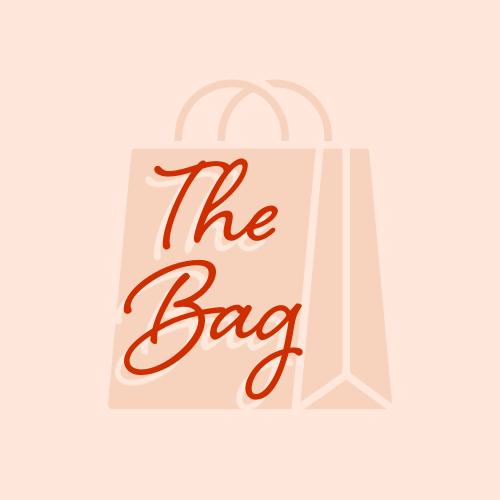

<p align="center">
  
</p>

# The Bag

BitLife makes life disposable. **The Bag** makes your financial identity permanent: a life-sim where every swipe is a real money decision, every choice prints a receipt with the real math, and your Bag Score (300–850, like a credit score) carries over even when the character ends. It's built to be played in a minute a day, and a free daily Bag Check keeps players coming back.

**Demo video:** [link](https://youtu.be/JSGZMKKQqIs)

**Bag Score:** smart choices add points; avoidant or impulse choices subtract.

## Four systems

1. **Money Type** — 5-question quiz (Saver / Splurger / Freezer / Chaser) that picks which Decision Deck a life draws from. *Why it matters:* it's the personalized hook and the reveal players share, and it makes the Decision Deck library worth unlocking in full.
2. **Decision Decks** — swipeable cards that print a **Receipt** with the real math. *Why it matters:* this is the core loop; the full library across all Money Types is part of Premium.
3. **The Ledger** — Bag Score, Playbooks, and past lives. Playbooks are *tools*: unlocking one adds an extra option on a later card. *Why it matters:* it's the permanent identity that makes progress feel worth keeping, and it's what a second Life slot builds on.
4. **The Bag Check** — one dated scenario per UTC day, always free, with a shareable receipt card. *Why it matters:* it's the daily habit and the growth loop. It stays free so the upgrade is never a tax on the habit.

## RevenueCat integration

Premium uses the **RevenueCat Web SDK** ([`@revenuecat/purchases-js`](https://www.npmjs.com/package/@revenuecat/purchases-js)) with Web Billing (Stripe), so it runs in the browser without App Store or Play Store accounts. All of it lives in [`TheBagApp.jsx`](TheBagApp.jsx):

| Piece | Where (search for) | What it does |
| --- | --- | --- |
| SDK setup | `configurePurchases()` | Calls `Purchases.configure()` once, using a stable `bag_player_id` from `localStorage` as the app user ID so purchases follow the player. |
| Entitlement check | `usePremiumEntitlement()`, `PREMIUM_ENTITLEMENT` | Reads `customerInfo.entitlements.active["premium"]` and re-reads it when the tab regains focus. Premium is never stored in a local flag. |
| Paywall | `PaywallOverlay` | Fetches `Purchases.getOfferings()` and renders the current offering's packages (price, period, trial and perk copy) from RevenueCat, not hardcoded. |
| Purchase | `onBuy` in `PaywallOverlay` | Calls `Purchases.purchase({ rcPackage })`, opens RevenueCat's hosted checkout, and updates the UI from the returned `customerInfo`. |
| Premium gate | `LifeSlotSwitcher`, `isPremium` in the app root | The second Life slot is locked until the `premium` entitlement is active. Tapping it opens the paywall. |
| Entry point | `SettingsScreen` | Shows "Upgrade to Family Plan", or "Manage your plan" once subscribed. |

### Configuring RevenueCat

1. In RevenueCat, create a Web Billing app, connect Stripe (test mode), and copy its **public** API key.
2. Create a `premium` entitlement and attach your products (for example monthly individual, monthly family, and lifetime) to it.
3. Add those products as packages in the **current** offering. Optionally set a `features` string array in the offering's metadata to control the perk list.
4. Provide the key to the app via a `.env.local` file:

```bash
VITE_REVENUECAT_API_KEY=your_revenuecat_web_public_key
```

Without a key the app still runs on the free tier, and the paywall explains that plans can't be loaded.

## Where it lives

| System | Code |
| --- | --- |
| UI / loop | [`TheBagApp.jsx`](TheBagApp.jsx) |
| RevenueCat (SDK, paywall, entitlement) | [`TheBagApp.jsx`](TheBagApp.jsx) — see the table above |
| Decks, Playbooks, quiz | [`content/game.json`](content/game.json) (loaded by [`content.js`](content.js)) |
| Bag Check calendar | [`content/bagCheck.json`](content/bagCheck.json) via [`localBackend.js`](localBackend.js) |
| Ledger persist | `localStorage` key `the-bag-demo` in `localBackend.js` |
| Share card | [`shareCard.js`](shareCard.js) |

## Run

```bash
npm install
npm run dev
```

Open the URL Vite prints (usually `http://localhost:5173`). Use **Reset all progress** in Settings if you need a clean take.

To try a purchase, set `VITE_REVENUECAT_API_KEY` as described above, open **Settings → Upgrade to Family Plan**, and check out with a Stripe test card (`4242 4242 4242 4242`).

## 2-minute shot list (Saver)

Pick the **first answer** on every quiz question → The Saver. Goal: **Just get better with money**. Name: **Maya**.

| Time | Beat |
| --- | --- |
| 0:00–0:15 | Hook: "BitLife makes life disposable. The Bag makes financial identity permanent." |
| 0:15–0:30 | Quiz → Saver reveal, goal + name Maya, tap through avatar |
| 0:30–0:50 | Age 16 **First Job**: Research → swipe **left** (retail) → Receipt, Playbook unlock |
| 0:50–1:10 | Age 17 **Credit Card**: teal **Use Playbook** (paycheck tool) → Receipt, score jumps |
| 1:10–1:22 | Scroll Ledger: Bag Score sentence + Playbook badge |
| 1:22–1:35 | Bag Check tab → left choice → **Share Result** (PNG) |
| 1:35–1:55 | Settings → Family Plan → paywall → Stripe test purchase → UI shows Premium |
| 1:55–2:00 | Hold the Ledger hero number, one-line pitch, point to the repo |
